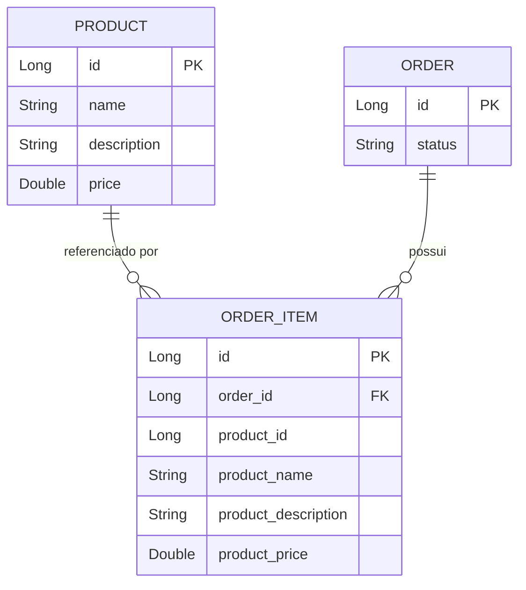

# Pedido Fácil

> **Versão:** 1.0   > 
> **Stack:** Java 17 · Spring Boot 3 · Maven 3.9+ · JPA / Hibernate

---

## 1. Visão Geral

A API REST do **Pedido Fácil** gerencia **Produtos** (catálogo) e **Pedidos** (compras) de forma simples, segura e eficiente. O design segue o modelo em camadas — *Controller → Service → Repository → Model* — e adota testes automatizados para garantir qualidade de código e confiabilidade.

* **Autenticação:** livre (CORS configurado), facilitando integração com front‑ends SPA.
* **Persistência:** banco relacional (H2 nos testes, MySQL/PostgreSQL em produção).
* **Empacotamento:** JAR executável ou imagem Docker.

---

## 2. Estrutura de Pastas

```text
src/main/java/com/ibeus/Comanda/Digital
 ├─ controller   # Endpoints REST
 ├─ dto          # Data Transfer Objects
 ├─ model        # Entidades JPA
 ├─ repository   # Spring Data Interfaces
 └─ service      # Regras de negócio
src/test/java/com/ibeus/Comanda/Digital
 ├─ Controller   # Testes de camada web (MockMvc)
 ├─ repository   # Testes JPA (H2)
 └─ service      # Testes unitários com Mockito
```

---

## 3. Modelo de Dados



Cada **ORDER\_ITEM** armazena um *snapshot* do produto, preservando histórico mesmo após alterações em `PRODUCT`.

---

## 4. Endpoints REST

| Método | Caminho          | Descrição                  | Corpo (✓ obrig.)      | Resposta                              |
| ------ | ---------------- | -------------------------- | --------------------- | ------------------------------------- |
| GET    | `/products`      | Listar produtos            | –                     | 200 · `[ProductResponseDTO]`          |
| GET    | `/products/{id}` | Obter produto              | –                     | 200 · `ProductResponseDTO`            |
| POST   | `/products`      | Criar produto              | ✓ `ProductRequestDTO` | 201 · `ProductResponseDTO` (Location) |
| PUT    | `/products/{id}` | Atualizar produto          | ✓ `ProductRequestDTO` | 200 · `ProductResponseDTO`            |
| DELETE | `/products/{id}` | Remover produto            | –                     | 204                                   |
| GET    | `/orders`        | Listar pedidos             | –                     | 200 · `[OrderResponseDTO]`            |
| GET    | `/orders/{id}`   | Obter pedido               | –                     | 200 · `OrderResponseDTO`              |
| POST   | `/orders`        | Criar pedido               | ✓ `OrderRequestDTO`   | 201 · `OrderResponseDTO` (Location)   |
| PUT    | `/orders/{id}`   | Atualizar status do pedido | ✓ `OrderRequestDTO`   | 200 · `OrderResponseDTO`              |
| DELETE | `/orders/{id}`   | Cancelar pedido            | –                     | 204                                   |

### 4.1 Exemplo – Criar Pedido


POST /orders
```json
{
  "status": "Confirmado",
  "productIds": [1, 2]
}
```

---

## 5. DTOs e Validações

| DTO                  | Campos                                                 | Anotações Jakarta Bean Validation |
| -------------------- | ------------------------------------------------------ | --------------------------------- |
| `ProductRequestDTO`  | name·String, description·String, price·Double          | `@NotBlank`, `@NotNull`           |
| `ProductResponseDTO` | id·Long, name·String, description·String, price·Double | —                                 |
| `OrderRequestDTO`    | status·String, productIds·List                         | `@NotBlank`, `@NotEmpty`          |
| `OrderResponseDTO`   | id·Long, status·String, products·List                  | —                                 |
| `OrderItemDTO`       | id·Long, name·String, description·String, price·Double | —                                 |

---

## 6. Regras de Negócio (Service Layer)

1. **Snapshot de produtos**: na criação de pedido, atributos do produto são copiados para `ORDER_ITEM`, garantindo rastreabilidade.
2. **Atualização controlada**: apenas o campo `status` é passível de alteração em um pedido já gravado.
3. **Cascade**: `Order` propaga operações para `OrderItem` (`CascadeType.ALL`, `orphanRemoval=true`).

---

## 7. Persistência

* Repositórios estendem `JpaRepository`, oferecendo operações CRUD prontas.
* Configuração padrão utiliza \*\*strategy \*\***`IDENTITY`** para chaves primárias.
* `FetchType.EAGER` em `Order.items` simplifica a serialização JSON.

---

## 8. Segurança e CORS

`@CrossOrigin` está configurado conforme necessidade do projeto, permitindo acesso controlado a partir de front‑ends hospedados em domínios específicos.

---

## 9. Testes Automatizados

| Camada     | Abordagem        | Ferramentas             |
| ---------- | ---------------- | ----------------------- |
| Controller | Testes Web MVC   | MockMvc, JUnit 5        |
| Service    | Unit tests       | Mockito, JUnit 5        |
| Repository | Testes JPA em H2 | `@DataJpaTest`, JUnit 5 |

Para gerar relatório de cobertura:

```bash
mvn clean test jacoco:report
```

---

## 10. Build & Execução

### 10.1 Ambiente Local (Dev)

```bash
mvn spring-boot:run
# ou
mvn clean package
java -jar target/comanda-digital-0.0.1-SNAPSHOT.jar
```
---

## 11. Documentação OpenAPI & Swagger UI

Ao executar o aplicativo, a interface interativa estará disponível em:

```
http://localhost:8080/swagger-ui.html
```
